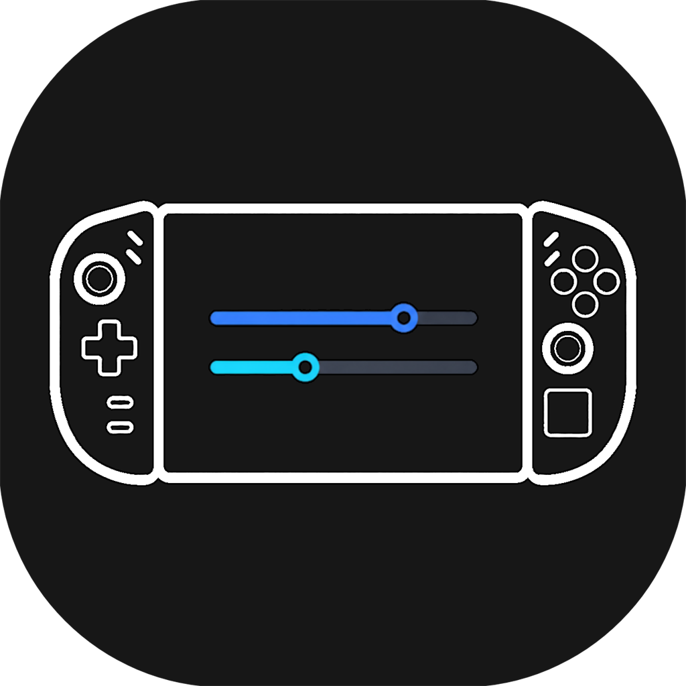

<div align="center">



# 🎮 GoTweaks Lite

**A stripped-down, Lenovo Legion Go 2–focused fork of [GoTweaks](https://github.com/corando98/GoTweaks).**

An Xbox Game Bar widget for controlling TDP, fans, RGB, controller remapping, gyro, per-game
profiles, and an OSD — rebuilt into a clean, predictable base tuned specifically for the
**Legion Go 2 (AMD Ryzen Z2 Extreme)**.

`C#` · `Xbox Game Bar widget` · `MIT source / GPL-3.0 binaries`

</div>

> [!NOTE]
> **Installation differs from the original.** Download the latest release and run
> **`GoTweaks-Setup.exe`** — see [Installation](#-installation) below — not the upstream
> download-and-run-`Install.ps1` steps.

---

## 📑 Contents

- [What's different from the original](#-whats-different-from-the-original)
- [Features](#-features)
- [Installation](#-installation)
- [Uninstalling](#uninstalling)
- [Requirements](#-requirements)
- [Technology](#-technology)
- [Credits & License](#-credits)

---

## ✨ What's different from the original

This is the fork's identity — everything below is what GoTweaks Lite changes relative to
upstream, and why.

### 🎯 Focus

- **Legion Go 2 first.** The build is tuned for the Legion Go 2 (Ryzen Z2 Extreme). Other
  handhelds may still work, but they aren't a priority — decisions optimize for the Legion Go 2.

### ⚡ Rebuilt TDP control

- **One _TDP Mode_ selector** — Quiet / Balanced / Performance (Lenovo firmware presets) +
  **Custom**, replacing the old sprawling TDP UI and the duplicate Legion-tab power-profile dropdown.
- **Custom = base TDP (SPL) + SPPT / FPPT boosts** — clamped to a 50 W safety ceiling and applied
  **live** over Lenovo WMI. Mirrors Legion Space semantics and removes the old dual-write-path
  conflicts that used to snap limits back to ~15 W.
- **Removed the standalone master TDP slider** — folded into the mode selector.

### 🧹 Removed for a leaner base

- **AutoTDP** (the Q-learning / SARSA power controller), **Sticky TDP**, the **TDP Boost** toggle,
  **Custom TDP Presets**, and the **Device Min/Max TDP** panel — the single _TDP Mode_ selector
  replaces them all.
- The beta **Sidebar overlay** — _Focus GoTweaks Lite_ now simply opens the Game Bar.
- **Microsoft / bundled Default Game Profiles** — only your own per-game profiles remain.
- The **Advanced panel** (core parking / affinity), the **AC/DC Power Plan** selector, and the debug
  **Themes** selector — niche or no-ops on the Legion Go 2.

> **Why:** a smaller, more predictable surface with fewer background systems that can silently
> fight your settings.

### ➕ Added

- **Auto SDR** — while HDR is on, automatically matches the SDR white level to screen brightness
  so SDR content (desktop, most games) doesn't look washed out. _(Ported from the sibling Go2HDR
  project.)_
- **Fix Task View Bug** _(Labs, opt-in)_ — a targeted fix for the Legion Go bug where, after a
  restart with a USB hub attached, focusing the desktop pops open Task View (Win+Tab) and buzzes
  the controller. It re-enumerates the controller's USB port once per boot — the software
  equivalent of physically replugging a pad. Enable it only if you have this bug.

### 🔧 Reliability fixes

- Correct **system-tray icon** (was the generic Windows icon).
- Fixed **swapped CPU/GPU wattage sensors** on the Legion Go 2 so OSD labels match Adrenalin.
- More reliable **AFMF toggle**, **fan-curve temperature** (now true CPU Tctl, not the chipset
  sensor), and **Fan Full Speed** — a custom fan curve also survives sleep/hibernate now instead
  of silently stopping.
- **Controller vibration & lighting persistence** across restarts, a **24-hour OSD clock**, extra
  navigation / media keys in the remap pickers, and improved **Lossless Scaling** runtime
  detection & reliability.
- **Closing the app window no longer kills the active Game Bar widget.** GoTweaks Lite can also be
  opened as a standalone window (Start menu / taskbar) alongside the Game Bar overlay; closing that
  window used to silently kill the widget's connection — it's now minimized instead, and the widget
  keeps running.

---

## 🧩 Features

### 🗂️ Quick Settings

A customizable dashboard of quick-access tiles for your most-used settings.

- One-tap toggles for TDP Mode, Profile, Overlay, and Lossless Scaling
- Custom keyboard-shortcut tiles you can add and remove
- Device-specific tiles that appear when supported hardware is detected

### ⚡ Performance Control

Fine-tune power and CPU settings for performance or battery life.

**TDP management**
- **TDP Mode** — Quiet / Balanced / Performance firmware presets, plus Custom
- **Custom Power Limits** — base TDP (SPL) with independent SPPT and FPPT boosts, a 50 W ceiling,
  and live apply while dragging
- **Live readout** — current SPL / SPPT / FPPT confirmed straight from the hardware

**CPU controls**
- **CPU Boost** — enable or disable CPU boost
- **CPU EPP** — Energy Performance Preference (0–100)
- **Min / Max CPU State** — control the CPU clock-speed range

### 🎯 Per-Game Profiles

Automatically apply your preferred settings when each game launches.

- Automatic profile switching on game detection
- Saves all performance settings per game:
  - TDP (SPL / SPPT / FPPT) and CPU settings
  - AMD Radeon features
  - Lossless Scaling configuration
  - Legion Go controller settings

### 🕹️ Legion Go 2 Support

Deep support for the Legion Go 2 with automatic device detection.

**Performance modes**
- Quiet, Balanced, Performance, and Custom
- Custom TDP with fine-grained control (SPL, SPPT, FPPT)
- Fan Full Speed toggle

**Controller settings**
- **Button Remapping** — customize the M2, M3, Y1, Y2, Y3 buttons
- **Remap type** — map to keyboard shortcuts, keys, gamepad actions, or mouse buttons
- **Joystick to Mouse** — emulate a mouse with either stick
- **Desktop Controls** — map controls to mouse + left/right click, similar to the ROG Ally
- **Nintendo Layout** — swap the button layout
- **Stick Deadzones** — adjust left/right stick deadzones (0–50%)
- **Gyroscope** — enable/disable with target selection, X/Y sensitivity, axis inversion, and
  activation mode (Hold/Toggle) with a button binding
- **Vibration Mode** — configure vibration behavior
- **Touchpad Haptics** — toggle haptic feedback

**RGB lighting**
- Light mode, color, brightness, and speed control
- Power-light toggle

**Other**
- Touchpad toggle
- Battery charge limit

### 🎮 Controller Emulation (VIIPER)

Present the Legion Go's controls as a different virtual gamepad — useful for games or Steam Input
profiles that expect a specific pad type, or that support native gyro aim only on certain
controllers.

- **Virtual device types** — Xbox 360, DualShock 4, DualSense, DualSense Edge, Switch Pro, Joy-Con
  pair, or Steam Controller
- **Native gyro/accel forwarding** — the Legion Go's own motion sensors drive the emulated pad's
  gyro, so games read real hardware motion instead of a stick-to-gyro conversion
- **Alternate Gyro Convention** toggle — flips gyro polarity per target if a game's aim feels
  inverted
- **Guide-button remap** — map a Legion button to Xbox Guide independent of whether full emulation
  is on
- Requires the free **usbip-win2** driver — install it once from the in-app prompt (Controller
  Emulation tab or the setup-warning banner)

### 🔴 AMD Radeon Features

GPU-based enhancements for AMD graphics.

| Category | Feature |
| --- | --- |
| **Upscaling & frame gen** | Radeon Super Resolution (RSR) with sharpness · AMD Fluid Motion Frames (AFMF) |
| **Performance** | Radeon Anti-Lag · Radeon Boost (dynamic resolution) |
| **Power saving** | Radeon Chill with min/max FPS |
| **Image quality** | Image Sharpening · display color controls (brightness, contrast, saturation, temperature) |

### 🖼️ Lossless Scaling Integration

Control Lossless Scaling directly from the widget _(the Scale tab appears when Lossless Scaling is
detected)_.

- Launch and manage Lossless Scaling
- Configure scaling type and factor
- Frame-generation modes (LSFG2, LSFG3)
- Auto-scaling with configurable delay
- Anime4K and FSR optimization options
- Per-profile configurations

### 🖥️ Graphics Settings

Display and resolution management.

- Resolution control with auto-detection
- Refresh-rate adjustment
- HDR toggle (when supported)
- **Auto SDR** — match the SDR white level to screen brightness while HDR is active

### 📊 Performance Overlay (OSD)

A real-time on-screen display powered by RivaTuner Statistics Server.

- **Detail levels** — Off, Minimal, Standard, Detailed
- **Metrics** — FPS (rendered + displayed via PresentMon) with a `[FG]` badge, frametime graph and
  frame-budget readout, CPU/GPU usage & temperatures, power draw, memory & VRAM, battery, fan speed,
  and TDP limits (SPL/SPPT/FPPT) or the current performance mode

### 🎮 Controller Navigation

Designed for full gamepad control — no mouse needed.

- D-pad navigation between all controls
- Visual focus indicators
- Automatic scroll to the focused item
- Works with Xbox, PlayStation, and other controllers

---

## 📦 Installation

GoTweaks Lite ships as a sideloaded MSIX package signed with a self-signed certificate, so the
installer first tells Windows to trust that certificate.

### 1. Install

1. Grab the latest release — a folder/zip with `GoTweaks_<version>.msixbundle`, its matching
   `.cer`, and the installer. **Keep all files in the same folder.**
2. **Close the Game Bar overlay** if it's open (`Win + G` to check) — an open Game Bar keeps the
   old version running and blocks the update.
3. Double-click **`GoTweaks-Setup.exe`**.
4. Click **Yes** on the UAC prompt — needed only to trust the certificate.
5. A small progress window appears; wait for the **"GoTweaks Lite installed"** confirmation.

> [!NOTE]
> **Windows may show a "Windows protected your PC" SmartScreen warning** the first time you run
> the installer — this is normal for a freshly downloaded, unsigned executable and not specific to
> GoTweaks Lite. Click **More info** → **Run anyway** to continue.

> If `GoTweaks-Setup.exe` is missing or blocked, use **`Install GoTweaks.bat`** instead — same
> steps, a console window instead of a GUI. If double-clicking the `.bat` does nothing (or
> SmartScreen blocks it entirely), open PowerShell in the same folder (Shift + right-click the
> folder → **Open PowerShell window here**) and run:
> ```powershell
> powershell -ExecutionPolicy Bypass -File ".\Install GoTweaks.ps1"
> ```
> Right-click → **Run with PowerShell** does **not** work here — it skips the `-ExecutionPolicy
> Bypass` the script needs, and fails with a "running scripts is disabled" error on most default
> Windows setups.

The installer trusts the certificate, closes blocking processes, and installs/updates the widget in
place — your profiles and settings are kept.

### 2. Enable the widget

1. Open Xbox Game Bar (`Win + G`)
2. Open the **widget menu**
3. Find and enable **“GoTweaks Lite”**

> The **first launch shows one more UAC prompt** — the elevated helper that drives the hardware
> (TDP, fans, RGB) needs administrator rights. After that it registers a scheduled task, so future
> launches are silent.

### 3. Enable game detection

Required for per-game profiles:

1. Open Xbox Game Bar → **Settings** → **More Settings**
2. Find the **GoTweaks Lite** widget
3. Enable **“Know which game or app is in focus”**

### Uninstalling

The release includes **`Uninstall-GoTweaks.ps1`**, which cleanly restores your system: it stops the
helper, clears any HidHide controller-hiding rules it added (so a controller is never left hidden),
sweeps leftover virtual controllers, removes the scheduled task, and then removes the app package
itself. Shared drivers (PawnIO, ViGEmBus) are left installed by default since other tools may use
them too — pass `-RemoveDrivers` to also uninstall those.

Open **PowerShell as Administrator**, `cd` to the folder with the release files, then run:

```powershell
powershell -ExecutionPolicy Bypass -File ".\Uninstall-GoTweaks.ps1"
```

---

## ✅ Requirements

| | |
| --- | --- |
| **OS** | Windows 10 / 11 |
| **Required** | Xbox Game Bar |
| **Optional** | [RivaTuner Statistics Server](https://www.guru3d.com/download/rtss-rivatuner-statistics-server-download/) (OSD overlay) · [PawnIO](https://github.com/SuporteTI/PawnIO) (extended sensors: fan speed, GPU power) · [usbip-win2](https://github.com/vadimgrn/usbip-win2/releases) (controller emulation / VIIPER — installable in-app) · AMD GPU (Radeon features) · Legion Go 2 / Legion Go (device features) · Lossless Scaling (scaling integration) |

> [!IMPORTANT]
> **Smart App Control** may interfere with this application. If it doesn't work correctly, you may
> need to disable Smart App Control in Windows Security. _(Other handheld software like ASUS Armoury
> Crate hits the same Smart App Control issue.)_

---

## 🛠️ Technology

Free and open source. Built with C#.

| Library | Purpose |
| --- | --- |
| **LibreHardwareMonitor** | Hardware sensors and monitoring |
| **RyzenAdj** | AMD TDP control |
| **RTSSSharedMemoryNET** | Custom build with frametime-graph support, tuned for low CPU/memory use |
| **ADLX** | AMD Display Library for Radeon features |
| **PresentMon** | Rendered / displayed FPS and frame-generation metrics |
| **libviiper** (usbip-win2) | USBIP-based virtual controller emulation with native gyro |

---

## 🙏 Credits

GoTweaks Lite builds on the work of the upstream projects:

- **[GoTweaks](https://github.com/corando98/GoTweaks)** by corando98 — the fork this project is based on.
- **[Original widget](https://github.com/namquang93)** by namquang93 — where GoTweaks itself grew from.

## 📄 License

GoTweaks Lite has a layered license, inherited from upstream:

- The **original source code** is licensed under the **MIT License** (see [`LICENSE`](LICENSE)).
- The **distributed binaries** link `libviiper.dll` (a GPL-3.0 fork of VIIPER), so the
  **combined work as distributed is conveyed under the GPL-3.0** (see [`COPYING`](COPYING)).

See [`LICENSING.md`](LICENSING.md) and [`THIRD-PARTY-NOTICES.md`](THIRD-PARTY-NOTICES.md) for the full
details and the written offer of source.
