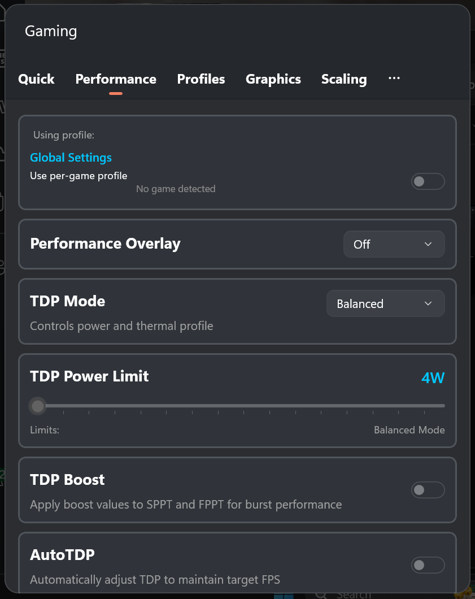
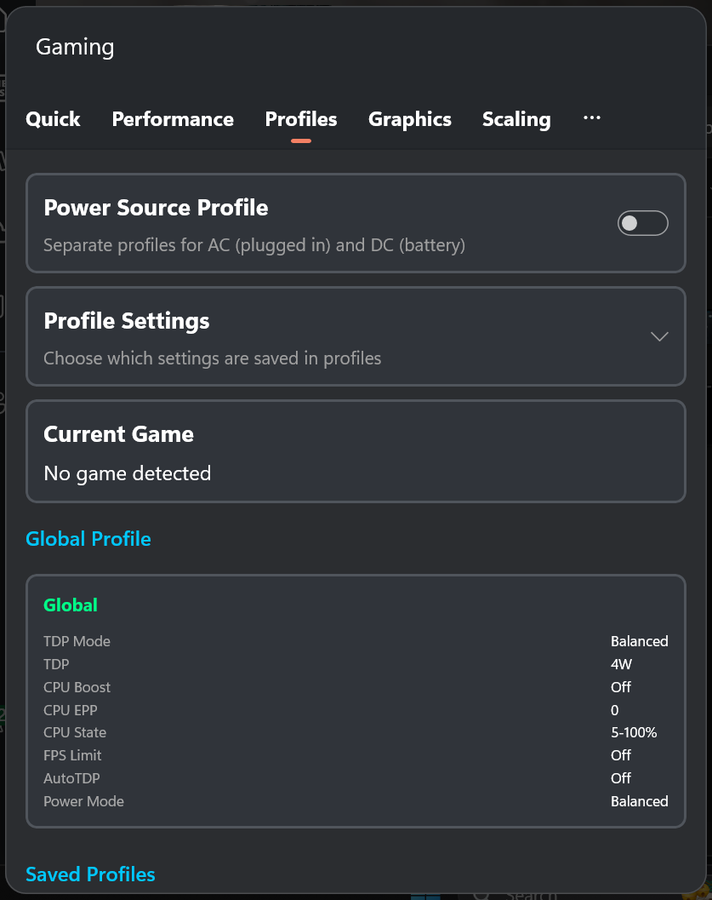
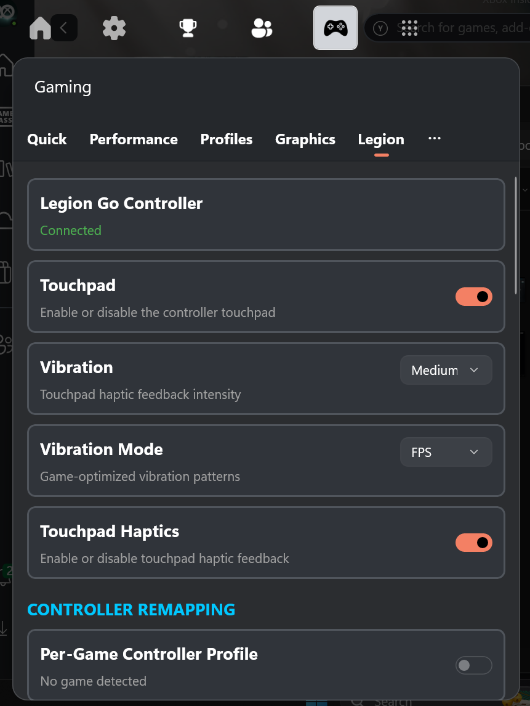
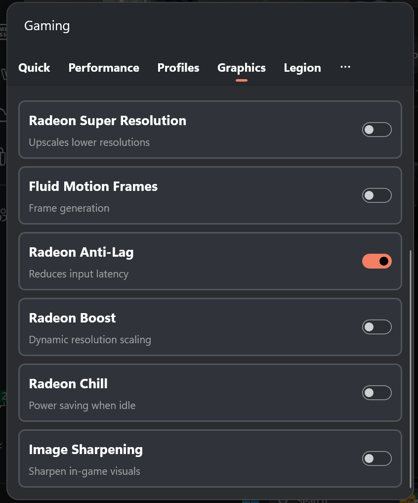
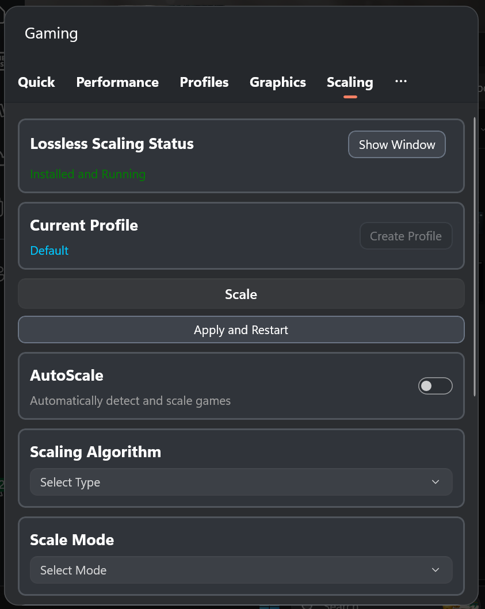
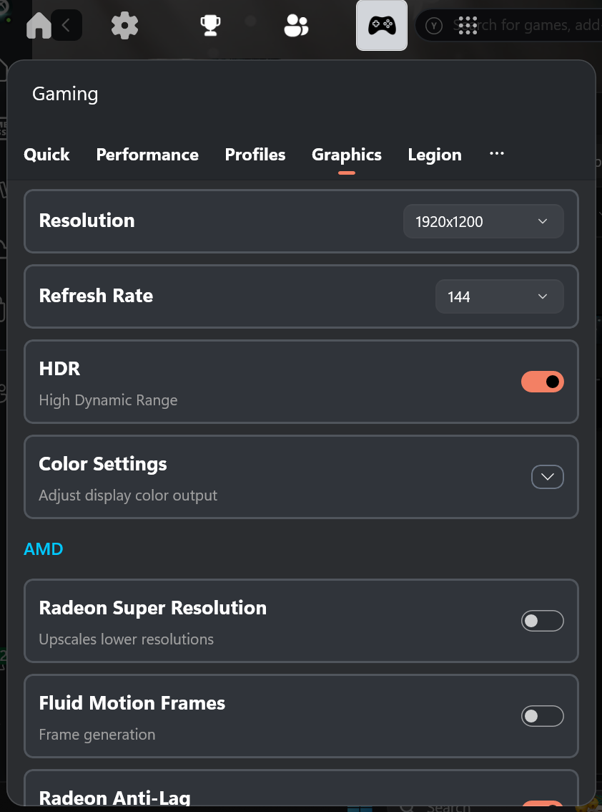
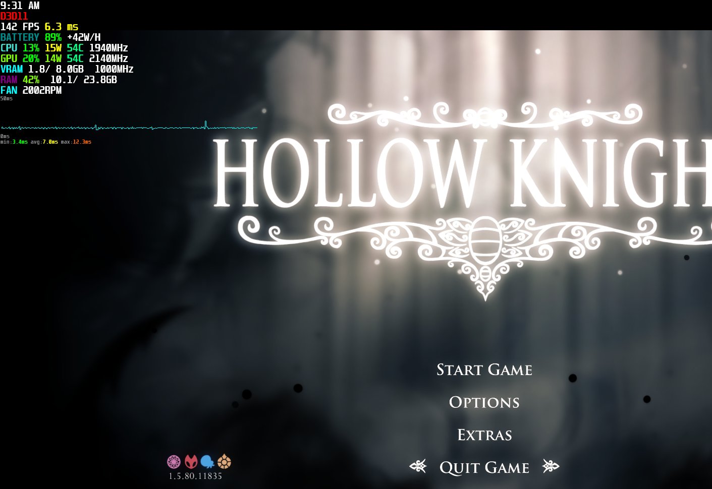

# GoTweaks Lite

A stripped-down, **Lenovo Legion Go 2**-focused fork of [GoTweaks](https://github.com/corando98/GoTweaks) by corando98 (itself a fork of [namquang93](https://github.com/namquang93)'s original). It keeps the same Xbox Game Bar widget foundation but trims it into a clean, predictable base built specifically for the Legion Go 2 (AMD Ryzen Z2 Extreme) — then refines it.

> **Installing differs from the original** — use the [`Installer/`](Installer/) folder (run **Install GoTweaks.bat**), not the original download-and-run-`Install.ps1` steps.

---

## What's different from the original

This is the fork's identity. Everything below is what GoTweaks Lite changes relative to upstream, and why.

### Focus
- **Legion Go 2 first.** The build is tuned for the Legion Go 2 (Ryzen Z2 Extreme). Other handhelds may still work, but they are not a priority — decisions optimize for the Legion Go 2.

### Rebuilt TDP control
- **One *TDP Mode* selector** — Quiet / Balanced / Performance (Lenovo firmware presets) + **Custom**, replacing the old sprawling TDP UI and the duplicate Legion-tab power-profile dropdown.
- **Custom = base TDP (SPL) + SPPT/FPPT boosts**, clamped to a 50 W safety ceiling and applied **live** over Lenovo WMI. This mirrors Legion Space semantics and removes the old dual-write-path conflicts that used to reset limits back to ~15 W.
- **Removed the standalone master TDP slider** — it's folded into the mode selector.

### Removed for a leaner base
- **AutoTDP** (the Q-learning/SARSA automatic power controller), **Sticky TDP**, the **TDP Boost** toggle, **Custom TDP Presets**, and the **Device Min/Max TDP** panel — the single *TDP Mode* selector replaces all of them.
- The beta **Sidebar overlay** — *Focus GoTweaks* now simply opens the Game Bar.
- **Microsoft / bundled Default Game Profiles** — only your own per-game profiles remain.
- The **Advanced panel** (core parking / affinity), the **AC/DC Power Plan** selector, and the debug **Themes** selector — niche or no-ops on the Legion Go 2.

*Why:* a smaller, more predictable surface with fewer background systems that can silently fight your settings.

### Added
- **Auto SDR** — while HDR is on, automatically matches the SDR white level to screen brightness so SDR content (desktop, most games) doesn't look washed out. (Ported from the sibling Go2HDR project.)
- **PresentMon-based OSD metrics** — real rendered vs displayed FPS, a `[FG]` frame-generation badge, and a frame-budget readout.
- **Fix Task View Bug** (Labs, opt-in) — a targeted fix for the Legion Go bug where, after a restart with a USB hub attached, focusing the desktop pops open Task View (Win+Tab) and buzzes the controller. It re-enumerates the controller's USB port once per boot — the software equivalent of physically replugging a pad. Enable it only if you have this bug.

### Reliability fixes
- Correct **system-tray icon** (was the generic Windows icon).
- Fixed **swapped CPU/GPU wattage sensors** on the Legion Go 2 so OSD labels match Adrenalin.
- More reliable **AFMF toggle**, **fan-curve temperature** (now true CPU Tctl, not the chipset sensor) and **Fan Full Speed**.
- **Controller vibration & lighting persistence** across restarts, a **24-hour OSD clock**, extra navigation/media keys in the remap pickers, and improved **Lossless Scaling** runtime detection & reliability.

### Self-updates disabled
- This fork will **not** auto-update to the upstream (corando98) build. Update checks are no-ops until a release repository is configured, so you stay on the Lite build. Install and update by running the bundled installer.

---

## Features

### Quick Settings
Customizable dashboard with quick-access tiles for your most-used settings.

- One-tap toggles for TDP Mode, Profile, Overlay, Lossless Scaling
- Custom keyboard shortcut tiles with add/remove functionality
- Device-specific tiles that appear when supported hardware is detected

---

### Performance Control
Fine-tune power and CPU settings for optimal performance or battery life.

**TDP Management:**
- **TDP Mode** - Quiet / Balanced / Performance firmware presets, plus Custom
- **Custom Power Limits** - Base TDP (SPL) with independent SPPT and FPPT boosts, a 50 W ceiling, and live apply while dragging
- **Live readout** - Current SPL / SPPT / FPPT confirmed straight from the hardware

**CPU Controls:**
- **CPU Boost** - Enable or disable CPU boost
- **CPU EPP** - Energy Performance Preference (0-100)
- **Min/Max CPU State** - Control CPU clock speed range

---

### Per-Game Profiles
Automatically apply your preferred settings when each game launches.

- Automatic profile switching on game detection
- Saves all performance settings per game:
  - TDP (SPL / SPPT / FPPT), CPU settings
  - AMD Radeon features
  - Lossless Scaling configuration
  - Legion Go controller settings (if applicable)

---

### Legion Go Support
Deep support for the Legion Go 2 (and other Legion Go handhelds) with automatic device detection.

**Performance Modes:**
- Quiet, Balanced, Performance, and Custom modes
- Custom TDP with fine-grained control (SPL, SPPT, FPPT)
- Fan Full Speed toggle

**Controller Settings:**
- **Button Remapping** - Customize M2, M3, Y1, Y2, Y3 buttons
- **Remap type** - Remap to keyboard shortcuts, keys, gamepad actions, or mouse buttons
- **Joystick to Mouse** - Emulate a mouse using either the left or right stick
- **Desktop Controls** - Maps the controls to mouse, left mouse button, and right click, similar to ROG Ally
- **Nintendo Layout** - Swap button layout
- **Stick Deadzones** - Adjust left/right stick deadzones (0-50%)
- **Gyroscope Settings:**
  - Enable/disable with target selection
  - Sensitivity X/Y adjustment
  - Invert axes options
  - Activation mode (Hold/Toggle) with button selection
- **Vibration Mode** - Configure vibration behavior
- **Touchpad Haptics** - Toggle haptic feedback

**RGB Lighting:**
- Light mode, color, brightness, and speed control
- Power light toggle

**Other:**
- Touchpad toggle
- Battery charge limit

---

### AMD Radeon Features
GPU-based enhancements for AMD graphics cards.

**Upscaling & Frame Generation:**
- **Radeon Super Resolution (RSR)** - GPU upscaling with sharpness control
- **AMD Fluid Motion Frames (AFMF)** - Frame generation

**Performance:**
- **Radeon Anti-Lag** - Reduce input latency
- **Radeon Boost** - Dynamic resolution scaling

**Power Saving:**
- **Radeon Chill** - Reduce power when idle with min/max FPS control

**Image Quality:**
- **Image Sharpening** - Enhance visual clarity
- **Display Color Controls** - Brightness, contrast, saturation, color temperature

---

### Lossless Scaling Integration
Control Lossless Scaling directly from the widget (the Scale tab appears when Lossless Scaling is detected).

- Launch and manage Lossless Scaling
- Configure scaling type and factor
- Frame generation modes (LSFG2, LSFG3)
- Auto-scaling with delay configuration
- Anime4K and FSR optimization options
- Per-profile configurations

---

### Graphics Settings
Display and resolution management.

- Resolution control with auto-detection
- Refresh rate adjustment
- HDR toggle (when supported)
- **Auto SDR** - Match the SDR white level to screen brightness while HDR is active

---

### Performance Overlay (OSD)
Real-time on-screen display powered by RivaTuner Statistics Server.

**Multiple Detail Levels:**
- Off, Minimal, Standard, Detailed

**Metrics Displayed:**
- FPS (rendered and displayed, via PresentMon) with a `[FG]` frame-generation badge
- Frametime graph and frame-budget readout
- CPU/GPU usage and temperatures
- Power consumption
- Memory and VRAM usage
- Battery level and status
- Fan speed (supported devices)
- TDP Limits (SPL/SPPT/FPPT) or current performance mode

---

### Controller Navigation
Designed for full gamepad control - no mouse needed.

- D-pad navigation between all controls
- Visual focus indicators
- Automatic scroll to focused items
- Works with Xbox, PlayStation, and other controllers

---

## Installation

GoTweaks Lite ships as a sideloaded MSIX package signed with a self-signed certificate, so the installer first tells Windows to trust that certificate.

### Install (Recommended)

1. Grab the latest release package — a folder/zip containing `GoTweaks_<version>.msixbundle`, its matching `.cer`, and the installer. Keep all files **in the same folder**.
2. **Close the Game Bar overlay** if it's open (`Win + G` to check) — an open Game Bar keeps the old version running and blocks the update.
3. Double-click **`Install GoTweaks.bat`**.
4. Click **Yes** on the administrator (UAC) prompt — this is only needed to trust the certificate.
5. Wait for **"Done — GoTweaks Lite installed."**

> If double-clicking the `.bat` is blocked, right-click **`Install GoTweaks.ps1`** → **Run with PowerShell**.

The installer trusts the certificate, closes blocking processes, and installs/updates the widget in place (your profiles and settings are kept).

### Enable the Widget

1. Open Xbox Game Bar (`Win + G`)
2. Open the **widget menu**
3. Find and enable **"GoTweaks"**

The **first launch shows one more UAC prompt** — the elevated helper that controls the hardware (TDP, fans, RGB) needs administrator rights. After that it registers a scheduled task so future launches are silent.

### Enable Game Detection

Required for per-game profiles:

1. Open Xbox Game Bar → **Settings** → **More Settings**
2. Find the **GoTweaks** widget
3. Enable **"Know which game or app is in focus"**

---

## Requirements

- Windows 10/11
- Xbox Game Bar
- **Optional:**
  - [RivaTuner Statistics Server](https://www.guru3d.com/download/rtss-rivatuner-statistics-server-download/) (required for the OSD overlay)
  - [PawnIO](https://github.com/SuporteTI/PawnIO) (required for extended sensors like fan speed and GPU power draw on some devices)
  - AMD GPU (for Radeon features)
  - Legion Go 2 / Legion Go (for device-specific features)
  - Lossless Scaling (for the scaling integration)

### Smart App Control

**Important:** Windows Smart App Control may interfere with this application. If the app doesn't work correctly, you may need to disable Smart App Control in Windows Security settings.

Note: other gaming software like ASUS Armoury Crate (for ROG Ally) faces similar Smart App Control compatibility issues.

---

## Technology

Free and open source. Built with C#.

### Libraries
- **LibreHardwareMonitor** - Hardware sensors and monitoring
- **RyzenAdj** - AMD TDP control
- **RTSSSharedMemoryNET** - Custom implementation with frametime graph support, optimized for low CPU and memory usage
- **ADLX** - AMD Display Library for Radeon features
- **PresentMon** - Rendered/displayed FPS and frame-generation metrics

---

## Credits

GoTweaks Lite builds on the work of the upstream projects:

- **[GoTweaks](https://github.com/corando98/GoTweaks)** by corando98 — the fork this project is based on.
- **[Original widget](https://github.com/namquang93)** by namquang93 — the project GoTweaks itself grew from.

## License

GoTweaks Lite has a layered license, inherited from upstream:

- The **original source code** is licensed under the **MIT License** (see [`LICENSE`](LICENSE)).
- The **distributed binaries** link `libviiper.dll` (a GPL-3.0 fork of VIIPER), so the
  **combined work as distributed is conveyed under the GPL-3.0** (see [`COPYING`](COPYING)).

See [`LICENSING.md`](LICENSING.md) and [`THIRD-PARTY-NOTICES.md`](THIRD-PARTY-NOTICES.md)
for the full details and the written offer of source.
